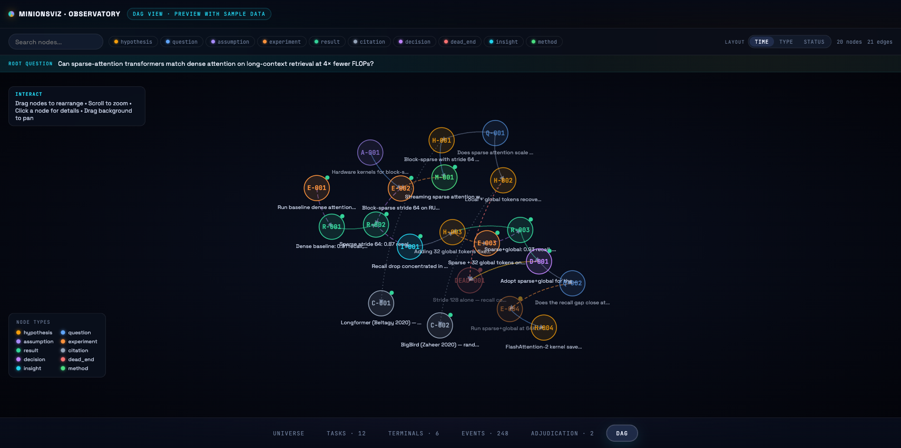

<div align="center">

# MinionsOS



**Local multi-agent OS for autonomous, paper-sized research projects.**

[](https://www.python.org/)
[](https://nodejs.org/)
[](#)

[English](#english) · [中文](#中文)

</div>

---

## English

**MinionsOS** is a local multi-agent operating system for running isolated,
research-grade projects. A persistent **Gru** supervisor manages projects;
each project owns its own **EACN3** coordination backend; long-lived
agent-host **Roles** wake up on event arrival, process work, and stay resident
across many cycles. Claude Code is the only Role host; **Codex GPT-5.5** is
reachable as a sub-agent through the `codex-subagent` MCP server when a Role
wants to delegate high-intensity execution.

The runtime topology of each project is selected by a *Mission Profile*
(`minions/profiles/<name>.yaml`). The default `scientific-paper` profile drives
the full Autonomous Scientific Discovery pipeline (paper-sized projects with
Noter + Coder + Ethics + Writer producing peer-reviewed PDFs). Lightweight
profiles like `hle-answer` enable benchmark/leaderboard scenarios (HLE, MMLU,
GPQA, SWE-bench) by spawning a smaller role roster and evaluating against a
reference answer instead of running peer review. The full ASD capability is
preserved as the default — switching to benchmarks is opt-in via `--profile`.

The design goal is simple: one author, one checkout, one Gru, many isolated
research projects.

### Table of Contents

- [What You Get](#what-you-get)
- [Architecture](#architecture)
- [Repository Layout](#repository-layout)
- [Prerequisites](#prerequisites)
- [Install](#install)
- [Configure](#configure)
- [Run](#run)
- [Roles](#roles)
- [Skill family and autonomous evolution](#skill-family-and-autonomous-evolution)
- [MCP Surface](#mcp-surface)
- [Runtime Project Structure](#runtime-project-structure)
- [MinionsVIZ](#minionsviz)
- [Development](#development)
- [Troubleshooting](#troubleshooting)
- [Security and Configuration](#security-and-configuration)
- [License](#license)

### What You Get

- **Project isolation.** Every project has its own `project_{port}/` directory,
  EACN3 backend, SQLite state, per-project bare git repo, role worktrees, logs,
  artifacts, and event audit stream.
- **Mission Profiles.** Each project is parameterised by a *Mission Profile*
  (`minions/profiles/<name>.yaml`) declaring `roles_active`, `deliverable_schema`,
  `evaluation` strategy, `phase_schema`, and `on_done` behaviour. The default
  `scientific-paper` profile preserves the original Autonomous Scientific
  Discovery pipeline; `hle-answer` runs lightweight benchmark Q&A. New profiles
  ship as a single YAML file plus optional role-prompt overlays. Drives the
  `mos_submit` / `mos_evaluate` MCP tools and the `mos benchmark run` CLI for
  打榜 / leaderboard sweeps.
- **Long-lived Roles.** Noter, Coder, Writer, Ethics, and Expert run as
  resident `claude` processes inside named tmux sessions
  (`mos-{port}-{role}`). EACN-registered roles drive their event loop with
  `mos_await_events()`; Noter is the exception — it is not registered on EACN
  and uses the timer-based `mos_noter_wait()` instead. Writer is **on-demand**:
  not bootstrapped at project creation; Gru spawns it via `mos_spawn_role`
  when the project enters a paper-writing phase.
- **Gru as the control plane.** Gru is the human-facing supervisor and the only
  component allowed to create projects, spawn roles, and bridge across
  projects.
- **Codex as a subagent, not a host.** `codex-subagent` MCP exposes Codex
  GPT-5.5 to any Role as a full-access delegation target through a single
  `codex` tool. Codex never hosts a Role process directly.
- **Tool and write boundaries.** Claude roles receive `--allowed-tools`;
  MinionsOS additionally enforces project-lifecycle authorization inside its
  MCP server. Each Role owns `branches/<role>/`; cross-role artefacts always
  travel through `branches/shared/<subdir>/` via `mos_publish_to_shared`.
- **Layered memory.** Role context is reconstructed from the current
  invocation, the Reel (L0, raw verbatim transcripts), the Draft
  (`branches/shared/draft/draft.json`), the compiled-knowledge Book
  (`branches/shared/book/`), the cross-project Shelf, shared artefacts
  under `branches/shared/<subdir>/`, EACN history, and project `CLAUDE.md`.
  See [docs/reel-l0-memory.md](docs/reel-l0-memory.md) for the L0 design.
- **Skill discovery and domain assets.** Role skills live in
  `minions/roles/{role}/skills/*.md`; Expert domain-pack assets live in
  `minions/domains/*.md`.
- **Two-axis autonomous evolution.** A four-stage decorrelated pipeline —
  `skill-curator` (Noter proposes) → `skill-audit` (Ethics gates) →
  `skill-forge` (orchestrator validates) → Library / Expert roster — evolves
  Skills (add/revise/merge/split/drop) and Experts (spawn/dismiss/merge/split)
  from project trajectory. Backed by `mos_role_split`, `mos_role_merge`,
  `mos_role_evolve_evaluate`, `mos_role_evolve_dismiss` MCP tools. See
  `docs/research/role-evolution-experiments.md` for the empirical basis.
- **Visual format check.** `mos_visual_render` / `mos_visual_inspect` /
  `mos_visual_check` rasterize a PDF and detect layout defects (column void,
  trailing whitespace, edge overflow, float clustering). Available to every
  EACN-visible Role; reports persist under `branches/<role>/visual-reports/`.
- **Structured review.** Paper review runs through Gru's `mos_review_run` MCP
  tool, not through a long-lived Role. Its prompt assets (SYSTEM.md, procedural
  skills, reviewer personas, output templates) live under `minions/review/`,
  and a round produces 3-5 independent reviewer-instance reports plus a
  consolidated meta-review and rolling summary.
- **Experiment execution.** Coder owns experiment dispatch via the
  `mos_exp_*` tools — direct primitives (`mos_exp_run`, `mos_exp_status`,
  `mos_query_gpus`) and a Python-side project queue
  (`mos_exp_queue_submit`, `mos_exp_queue_plan`,
  `mos_exp_queue_reconcile`, `mos_exp_gpu_pool_set`).
- **Read-only observability.** `minions-viz/` provides a machine-wide
  MinionsVIZ dashboard without draining role queues or mutating EACN3.

### Architecture

```text
Author
  |
  v
Gru
  |
  +-- project_37596/
  |     |
  |     +-- EACN3 backend on 127.0.0.1:37596
  |     |     +-- Coder          -> branches/coder/  + branches/shared/exp/ + mos_exp_*
  |     |     +-- Writer (on-demand) -> branches/writer/
  |     |     +-- Ethics         -> branches/ethics/ + branches/shared/ethics/
  |     |     +-- Expert-*       -> branches/expert-<slug>/ + domain pack
  |     |
  |     +-- Noter (NOT on EACN; timer-driven via mos_noter_wait)
  |     |     -> branches/noter/ + branches/shared/notes/, draft/, book/
  |     |
  |     +-- branches/                # one git worktree per role plus shared
  |     |     +-- main/, noter/, coder/, writer/, ethics/, expert-*/, shared/
  |     +-- parent_repo.git/         # per-project bare git repo
  |     +-- eacn3_data/eacn3.db      # project-local EACN3 SQLite
  |     +-- events/                  # per-agent EACN event JSONL
  |     +-- state/                   # runtime control state
  |     +-- logs/
  |
  +-- project_37601/
        |
        +-- separate backend, branches, EACN state, events, and logs
```

Cross-project communication is intentionally narrow: Roles cannot talk to other
projects directly. Gru can bridge projects through the Gru-only
`mos_project_bridge` path.

### Repository Layout

```text
minions/
  cli.py                    # mos CLI entry point
  gru/                      # Gru monitor loop
  lifecycle/                # projects, roles, wakeup, relay, health
  tools/                    # MCP tools and experiment execution
  state/                    # runtime state helpers
  roles/                    # shared Role contract, prompts, skills
  review/                   # paper-review prompt assets used by mos_review_run
  domains/                  # Expert domain-pack assets
  config/*.yaml.example     # local config templates

minions-viz/                # read-only React/Vite dashboard
mcp-servers/                # standalone MCP servers
  eacn3/                    # local editable EACN3 dependency (Python + Node plugin)
  codex-subagent/           # Codex GPT-5.5 sub-agent bridge (Node)
  codegraph/                # Coder repo-graph MCP (Node)
docs/                       # delivery docs
  reel-l0-memory.md         #   L0 Reel layer design + tool surface
  integrations/             #   plug-in guides (claude-code, codex, eacn3, graphify)
  research/                 #   empirical bases for runtime decisions
tests/unit/                 # fast behavior tests
tests/smoke/                # integration-style smoke checks
```

Generated runtime output such as `project_{port}/`, `minions/state/`, logs,
caches, and `graphify-out/` is not committed.

### Prerequisites

- Python **3.11+**
- [`uv`](https://docs.astral.sh/uv/) for Python dependency management
- `git` 2.x
- Node **16+** and `npm` for the EACN3 MCP plugin and MinionsVIZ
- Claude CLI on `PATH`
- Codex CLI on `PATH` is **optional** — only required if a Role will delegate
  through the `codex-subagent` MCP

MinionsOS seeds project worktrees from the directory that contains this
checkout. That parent directory must be a git repository before you create
projects:

```bash
cd <parent-of-MinionsOS>
git init
git add -A
git commit -m "init"
```

`./install.sh` warns about this condition, and `./mos doctor` re-checks it. To
override the seed source, set `gru.yaml: author_repo` (or
`MINIONS_AUTHOR_REPO`).

### Install

```bash
git clone https://github.com/Minions-Land/MinionsOS.git
cd MinionsOS
./install.sh
./mos doctor
```

`install.sh` is idempotent. It bootstraps `uv` when needed, syncs Python
dependencies, installs the local editable `mcp-servers/eacn3/` package, builds
the EACN3 MCP plugin, builds MinionsVIZ when needed, creates launcher
symlinks, and copies `minions/config/*.yaml.example` to local `.yaml` files
without overwriting existing config.

### Configure

Local configuration lives under `minions/config/` and is intentionally ignored
by git:

- `gru.yaml` controls heartbeat cadence, logging, model/context settings,
  Noter cadence and model, draft thresholds, and web-search policy.
- `experiment_targets.yaml` defines local and SSH execution targets for Coder.
  Paths may use `{project_workspace}` template expansion.

Inspect resolved paths with:

```bash
./mos config
./mos config --json
```

Launcher:

```bash
./gru                 # launch interactive Gru (Claude-hosted)
```

### Run

```bash
./gru                 # launch interactive Gru
./noter <port>        # launch read-only Noter terminal for one project
./mos status          # project dashboard
./mos status --json   # machine-readable project status
./mos doctor          # environment health checks
```

Typical operator layout is one Gru terminal plus one Noter terminal per active
project:

```bash
./gru
./noter 37596
./noter 37601
```

The Noter terminal reports backend, role, task, and notes state without
draining EACN role queues. Type `wake <message>` inside it to queue an
on-demand Noter summary request through the project's EACN bus.

Project and role management:

```bash
./mos project list
./mos project list active
./mos project close <port>
./mos project revive <port>
./mos project repair <port>

./mos role list <port>
./mos role dismiss <port> <role>
```

Logs:

```bash
./mos logs
./mos logs --project <port>
./mos logs --project <port> --role coder --tail 100
./mos logs --project <port> --role coder --follow
```

### Roles

| Role | Responsibility | Primary write scope |
|---|---|---|
| Gru | Global supervisor, human interface, project lifecycle, cross-project bridge | `branches/main/`, `branches/shared/<any>/` |
| Noter | Timeline, checkpoints, summaries, Draft curation, Book maintenance | `branches/noter/`, `branches/shared/notes/`, `branches/shared/draft/draft.json`, `branches/shared/book/` |
| Coder | Code maintenance, debugging, experiment dispatch, remote execution, result collection | `branches/coder/`, `branches/shared/exp/`, `branches/shared/handoffs/`, `branches/shared/governance/` |
| Writer (on-demand) | Paper drafting, packaging, rebuttal, camera-ready work | `branches/writer/`, `branches/shared/handoffs/`, `branches/shared/governance/` |
| Ethics | Evidence audit, unsupported-claim detection over Coder's code/experiments | `branches/ethics/`, `branches/shared/ethics/`, `branches/shared/handoffs/`, `branches/shared/governance/` |
| Expert | Domain consultation with optional packs such as `nlp`, `cv`, `theory` | `branches/expert-<slug>/` (read-mostly), `branches/shared/handoffs/`, `branches/shared/governance/` |

Role prompts are stored at `minions/roles/{role}/SYSTEM.md`. The shared Role
contract at `minions/roles/SYSTEM.md` is injected before each role-specific
prompt. Skills are discovered from `minions/roles/{role}/skills/` at wake-up
and injected as a `[Skills]` summary block.

Paper review is **not** a Role: review prompt assets (system prompt, skills,
personas, templates) live under `minions/review/`, and a round is run by
Gru's `mos_review_run` MCP tool which writes `reviewer-instance.md`,
`fresh.md`, `revision_delta.md`, `consolidated.md`, and
`summaries/round-<n>.md` under `branches/shared/reviews/round-<n>/`. Reviewer
audits Writer's paper submissions; Ethics audits Coder's code and experiments
— do not conflate the two.

**Stewardship layer.** Two of the Roles also act as the system's stewardship
layer for the autonomous-evolution pipeline below: Noter's
`skill-curator-loop` skill emits Skill / Expert evolution proposals to
`branches/shared/notes/skill-proposals.md` on its periodic wake; Ethics'
`skill-audit` skill is the only authorised gate before those proposals can
mutate the Library or roster. Both are non-business Roles by design — they
do not bid on tasks, which keeps their judgements decorrelated from the
producers being evolved.

### Skill family and autonomous evolution

Beyond the human-driven extension paths (add a Role, add a skill, add a
domain pack, add an MCP tool), MinionsOS runs a **four-stage decorrelated
pipeline** that evolves the Skill library and the Expert roster from project
trajectory itself. The four components live at distinct authority levels:

| Stage | Component | Operator | Output |
|---|---|---|---|
| 1. Propose | `~/.claude/skills/skill-curator/` | Noter (via `skill-curator-loop`) | `branches/shared/notes/skill-proposals.md` — append-only ledger of add/revise/merge/split/drop (Knowledge axis) and spawn/dismiss/merge/split (Agent axis) proposals |
| 2. Audit | `minions/roles/ethics/skills/skill-audit.md` | Ethics | Per-pass verdict file under `branches/shared/ethics/`, plus inline `### audit` sub-block under each proposal |
| 3. Validate + ship | `~/.claude/skills/skill-forge/` (orchestrates `skill-edit` for form, `skill-evaluator` for behavioral A/B) | Gru routes accepted Knowledge-axis proposals here | Validated SKILL.md admitted to library |
| 4. Enact (Agent axis) | `mos_role_split`, `mos_role_merge`, `mos_role_evolve_evaluate`, `mos_role_evolve_dismiss`, `mos_spawn_role`, `mos_dismiss_role` | Gru | Updated Expert roster on EACN |

The decorrelation is structural, not procedural: the proposer (Noter, on
Sonnet, never makes business decisions), the auditor (Ethics, reads
artefacts not prompts), the validator (skill-forge, blind A/B with Codex as
judge), and the consumer Roles all draw from different parametric
distributions, which is the property the pipeline needs to actually reduce
multi-agent error rates. See `docs/research/role-evolution-experiments.md`
for the empirical findings that motivated the Agent-axis triggers, and
`minions/CLAUDE.md` "Skill and Agent population evolution" for the full Gru
intake contract.

### MCP Surface

The MinionsOS MCP server exposes lifecycle and execution tools from
`minions/tools/mcp_server.py`. All tools carry the `mos_` prefix.

**Gru-only — project lifecycle:**

```text
mos_project_create
mos_project_close
mos_project_dormant
mos_project_revive
mos_project_kill
mos_project_list
mos_project_set_phase
mos_project_checkpoint_workspace
mos_project_bridge
mos_start_monitor
mos_review_run
```

**Gru-only — role lifecycle:**

```text
mos_spawn_role
mos_spawn_expert
mos_attach_role
mos_dismiss_role
mos_kill_role
mos_list_roles
```

**Gru-only — cross-project Shelf (L3):**

```text
mos_shelf_register
mos_shelf_query
mos_shelf_shared_concepts
```

**Role event loop and context:**

```text
mos_await_events           # EACN-registered roles (Coder, Writer, Ethics, Expert)
mos_noter_wait             # Noter only — timer-based, not on EACN
mos_get_events
mos_unread_summary
mos_compact_context
mos_reset_context
mos_issue_report
```

**Cross-role publishing:**

```text
mos_publish_to_shared
```

**Reel — L0 raw verbatim transcripts (auto-captured; read-only for roles):**

```text
mos_reel_get
mos_reel_window
```

**Draft — L1 process memory (Noter primary, Gru read):**

```text
mos_draft_append
mos_draft_query
mos_draft_summary
mos_draft_annotate
mos_draft_path
mos_draft_decay_compute       # half-life-based confidence decay
mos_draft_commit_shared       # Noter periodic flush
```

**Book — L2 compiled knowledge (Noter writes; all roles read via query/hot_get):**

```text
mos_book_ingest
mos_book_ingest_batch
mos_book_lint
mos_book_query
mos_book_hot_get
mos_book_hot_update
mos_book_save_synthesis
mos_book_promote_verified
mos_book_crystallize_session
mos_book_audit_walk           # Ethics: list unresolved contradictions
mos_book_resolve_contradiction
```

**Role evolution (Agent-axis ops, gated by Ethics' `skill-audit`):**

```text
mos_role_evolve_evaluate      # produce evidence summary for split/merge/dismiss
mos_role_split                # one Expert → two with disjoint domains
mos_role_merge                # two Experts → one with union domain
mos_role_evolve_dismiss       # evidence-gated dismiss (distinct from mos_dismiss_role)
```

**Phase-transition signboard (governance):**

```text
mos_signboard_set
mos_signboard_read
mos_signboard_evaluate
mos_signboard_consume
mos_signboard_reopen
```

**Coder — experiment execution:**

```text
mos_exp_run
mos_exp_status
mos_exp_wait
mos_exp_kill
mos_exp_list
mos_exp_put
mos_exp_get
mos_exp_tail
mos_query_gpus
mos_exp_queue_submit
mos_exp_queue_plan
mos_exp_queue_reconcile
mos_exp_queue_status
mos_exp_gpu_pool_set
mos_exp_gpu_pool_get
```

**Expert — workflow-plugin discovery:**

```text
mos_list_workflow_plugins
```

**Visual format check (every EACN-visible Role; denied to Noter):**

```text
mos_visual_render             # PDF → page_NNN.png via Poppler
mos_visual_inspect            # detectors on PDF / image / page directory
mos_visual_check              # end-to-end: render + inspect + persist report
```

**Writer — paper search and retrieval:**

```text
mos_search_arxiv
mos_search_pubmed
mos_search_biorxiv
mos_search_medrxiv
mos_search_google_scholar
mos_search_semantic
mos_search_papers_federated
mos_resolve_arxiv_ids
mos_read_arxiv_paper
mos_read_pubmed_paper
mos_read_biorxiv_paper
mos_read_medrxiv_paper
mos_download_arxiv
mos_download_pubmed
mos_download_biorxiv
mos_download_medrxiv
```

**EACN3 plugin tools** (`eacn3_*`) are advertised to role mains that are
allowed to use the bus; they are not part of the MinionsOS MCP server.

### Runtime Project Structure

```text
project_{port}/
  CLAUDE.md                     # project narrative; Gru/author write, roles read
  AGENTS.md                     # Codex-subagent's view of project context
  meta.json                     # machine metadata
  parent_repo.git/              # per-project bare git repo, seeded from author HEAD
  branches/                     # one git worktree per role plus shared
    main/                       # Gru — branch minionsos/project-{port}
    noter/                      # Noter drafts
    coder/, writer/, ethics/, expert-<slug>/
      reel/                     # Layer 0 — raw verbatim transcripts (per role)
        <session_id>/
          index.jsonl
          transcripts/<task_id>.jsonl
    shared/                     # branch minionsos/project-{port}-shared
      draft/draft.json # Noter-curated Draft (L1)
      notes/                    # Noter staged reports (incl. skill-proposals.md)
      ethics/                   # Ethics published reports (incl. skill-audit-*.md)
      exp/exp-<id>/             # Coder experiment result bundles
      reviews/round-<n>/        # mos_review_run output (tool-owned)
      handoffs/                 # cross-role handoffs
      governance/signboard.json # phase-transition consensus
      book/                     # Layer 2 — compiled knowledge
        index.md                #   Noter-maintained catalog
        hot.md                  #   ~500-word rolling cache, injected at wake-up
        log.md                  #   append-only ingest/lint journal
        sources/                #   one page per ingested artifact
        contradictions/         #   auto-detected claim conflicts
      shelf/shelf.json          # Layer 3 — structural index (graphify-extracted)
  eacn3_data/eacn3.db           # per-project EACN3 SQLite database
  events/                       # per-agent EACN event JSONL audit stream
  state/                        # runtime control state (shared.lock, .reset_markers/)
  logs/
    backend.log
    role-{name}.log
```

The persistent cross-cycle memory surfaces are the **Reel** (L0,
`branches/<role>/reel/`, raw verbatim), the **Draft** (L1,
`branches/shared/draft/draft.json`, working coordination graph), the
**Book** (L2, `branches/shared/book/`, compiled durable knowledge), and the
**Shelf** (L3, project-local + Gru-only cross-project structural index).
Roles do not keep per-role private memory files; they reconstruct context at
wake-up from the current transcript, the Draft, the Book hot cache, EACN
history, shared artefacts, and project `CLAUDE.md`.

### MinionsVIZ

`minions-viz/` is a read-only Observatory for all Gru installations on the
same machine. It uses `~/.minionsos/` for registry and daemon state, serves
one shared URL, and lets the UI filter by Gru and project.

```bash
./viz ensure
./viz start
./viz status
./viz open
./viz logs

./mos viz ensure
./mos viz status
```

Environment knobs:

| Variable | Purpose |
|---|---|
| `GRU_VIZ=0` | disable Gru auto-starting the dashboard |
| `GRU_VIZ_OPEN=0` | suppress browser open |
| `MINIONS_VIZ_PORT=<port>` | override the default port, normally 7891 |
| `MINIONS_VIZ_REBUILD=1` | force rebuild during `./install.sh` |
| `MINIONS_GRU_LABEL=<name>` | override this Gru's dashboard label |

MinionsVIZ never POSTs to EACN3 and never calls `/api/events/{agent_id}`,
which would drain real role event queues.

### Development

Python checks:

```bash
uv sync
uv run pytest tests/unit -q
MINIONS_FAKE_CLAUDE=1 uv run pytest tests/smoke/
uv run ruff check .
uv run ruff format --check .
```

Dashboard checks:

```bash
cd minions-viz
npm install
npm run build
npm run dev
```

Useful extension points:

- Add a Role prompt under `minions/roles/{role}/SYSTEM.md`.
- Add a Role skill under `minions/roles/{role}/skills/{lowercase-hyphen}.md`.
- Update review behavior through `minions/review/skills/`,
  `minions/review/templates/`, `minions/review/personas/`, and the
  `mos_review_run` invariant tests together.
- Add an Expert domain pack under `minions/domains/{lowercase-hyphen}.md`.
- Add an MCP tool under `minions/tools/`, register it in
  `minions/tools/mcp_server.py`, then update the whitelist and tests.

See `AGENTS.md`, root `CLAUDE.md`, and `minions/CLAUDE.md` for contributor
rules and deeper architecture notes.

### Troubleshooting

| Problem | Check |
|---|---|
| Gru behavior | `minions/state/logs/gru.log` |
| Project backend is down | `project_{port}/logs/backend.log` |
| Role crashed or did not act | `project_{port}/logs/role-{name}.log` |
| Project metadata looks wrong | `project_{port}/meta.json` |
| EACN3 state needs inspection | `project_{port}/eacn3_data/eacn3.db` |
| Experiment failed | `project_{port}/branches/shared/exp/exp-{id}/report.md` |
| Viz is not reachable | `./viz status` and `./viz logs` |
| Doctor fails parent-git check | initialize and commit the parent directory |

### Security and Configuration

Do not commit secrets, generated project worktrees, experiment credentials,
runtime state, logs, or local config. Cross-project communication should
remain Gru-mediated, and dashboard endpoints must remain read-only.

### License

No explicit license file is currently bundled. Treat the repository as
proprietary/internal until a license is added.

---

## 中文

**MinionsOS** 是一个本地多智能体操作系统，用于运行相互隔离、论文级规模的科研项目。
常驻的 **Gru** 负责总控；每个项目拥有独立的 **EACN3** 协调后端；常驻的
**Role** 进程在事件触发时唤醒处理任务，跨多个事件周期保持驻留。Claude Code 是
唯一的 Role 宿主；当 Role 需要委派高强度执行时，可通过 `codex-subagent`
MCP 调用 **Codex GPT-5.5** 作为子代理。

目标很直接：一位作者、一份 checkout、一个 Gru，同时管理多个互不串扰的研究项目。

### 目录

- [能力概览](#能力概览)
- [架构](#架构)
- [仓库结构](#仓库结构)
- [环境要求](#环境要求)
- [安装](#安装)
- [配置](#配置)
- [运行](#运行)
- [Roles](#roles-1)
- [Skill 家族与自演化](#skill-家族与自演化)
- [MCP 工具面](#mcp-工具面)
- [运行时项目结构](#运行时项目结构)
- [MinionsVIZ](#minionsviz-1)
- [开发](#开发)
- [排障入口](#排障入口)
- [安全与配置](#安全与配置)
- [许可](#许可)

### 能力概览

- **项目隔离。** 每个项目都有独立的 `project_{port}/`、EACN3 后端、SQLite
  状态、独立 bare git 仓库、Role worktree、日志、产物以及事件审计流。
- **任务剖面（Mission Profile）。** 每个项目由一份 YAML 任务剖面
  (`minions/profiles/<name>.yaml`) 决定其角色阵容、产物 schema、评估策略、
  阶段调度和完成后行为。默认 `scientific-paper` 完整保留 Autonomous
  Scientific Discovery 流水线（Noter + Coder + Ethics + Writer 同行评议）；
  `hle-answer` 等轻量剖面用于打榜场景（HLE / MMLU / GPQA 等单题答案）。
  剖面切换通过 `mos_project_create(profile=...)` 或 CLI `--profile` 完成；
  原 ASD 能力作为默认行为完整保留，零破坏性变化。配套的 `mos_submit` /
  `mos_evaluate` MCP 工具与 `mos benchmark run <jsonl>` CLI 用于批量打榜。
- **常驻 Role。** Noter、Coder、Writer、Ethics 和 Expert 都是常驻 `claude`
  进程，运行在各自命名的 tmux 会话（`mos-{port}-{role}`）中。注册到 EACN
  的 Role 通过 `mos_await_events()` 驱动事件循环；Noter 是例外，它不注册到
  EACN，使用基于定时器的 `mos_noter_wait()`。Writer 是 **on-demand** 角色：
  项目创建时不会自动启动，由 Gru 在进入论文阶段时通过 `mos_spawn_role` 启动。
- **Gru 作为控制面。** Gru 是唯一人机入口，也是唯一可以创建项目、spawn Role、
  跨项目桥接的组件。
- **Codex 是子代理，不是宿主。** `codex-subagent` MCP 通过单一的 `codex`
  工具，把 Codex GPT-5.5 暴露给所有 Role，作为高强度执行的全权委派目标。
  Codex 永远不会直接 host 一个 Role 进程。
- **工具与写入边界。** Claude Role 通过 `--allowed-tools` 限制工具面；
  MinionsOS MCP server 在服务端额外执行项目生命周期工具授权。每个 Role 拥有
  自己的 `branches/<role>/`；跨角色产物始终经由 `branches/shared/<subdir>/`
  通过 `mos_publish_to_shared` 流转。
- **分层记忆。** Role 上下文来自当前事件、Reel（L0，`branches/<role>/reel/`
  原始 verbatim 转录）、Draft（`branches/shared/draft/draft.json`）、
  compiled-knowledge Book（`branches/shared/book/`）、跨项目 Shelf、
  `branches/shared/<subdir>/` 的共享产物、EACN 历史以及项目 `CLAUDE.md`。
  L0 设计见 [docs/reel-l0-memory.md](docs/reel-l0-memory.md)。
- **Skill 发现和领域资产。** Role 技能放在 `minions/roles/{role}/skills/*.md`；
  Expert 领域包资产放在 `minions/domains/*.md`。
- **双轴自演化。** 一条 4 阶段去相关流水线 —— `skill-curator`（Noter 提案）
  → `skill-audit`（Ethics 审计）→ `skill-forge`（编排器验证）→ Library /
  Expert roster —— 从项目轨迹中演化 Skill（add/revise/merge/split/drop）和
  Expert（spawn/dismiss/merge/split）。背后由 `mos_role_split`、
  `mos_role_merge`、`mos_role_evolve_evaluate`、`mos_role_evolve_dismiss`
  等 MCP 工具支持。经验依据见
  `docs/research/role-evolution-experiments.md`。
- **视觉格式检查。** `mos_visual_render` / `mos_visual_inspect` /
  `mos_visual_check` 把 PDF 栅格化并检测版式缺陷（栏内空洞、尾部留白、
  越界、浮动堆积等）。所有 EACN 上的 Role 都可调用，报告留存于
  `branches/<role>/visual-reports/`。
- **结构化评审。** 论文评审通过 Gru 的 `mos_review_run` MCP 工具运行，而不是
  常驻 Role。其提示资产（SYSTEM.md、流程 skill、reviewer persona、输出
  template）位于 `minions/review/`，单轮评审会产出 3-5 份独立 reviewer
  报告，加上 consolidated meta-review 和滚动 summary。
- **实验执行。** Coder 通过 `mos_exp_*` 工具拥有实验调度权限——既包括直接原语
  （`mos_exp_run`、`mos_exp_status`、`mos_query_gpus`），也包括 Python 侧
  项目队列（`mos_exp_queue_submit`、`mos_exp_queue_plan`、
  `mos_exp_queue_reconcile`、`mos_exp_gpu_pool_set`）。
- **只读观察台。** `minions-viz/` 提供机器级单例的 MinionsVIZ 仪表盘，不消耗
  Role 事件队列，也不修改 EACN3。

### 架构

```text
作者
  |
  v
Gru
  |
  +-- project_37596/
  |     |
  |     +-- EACN3 backend on 127.0.0.1:37596
  |     |     +-- Coder          -> branches/coder/  + branches/shared/exp/ + mos_exp_*
  |     |     +-- Writer (on-demand) -> branches/writer/
  |     |     +-- Ethics         -> branches/ethics/ + branches/shared/ethics/
  |     |     +-- Expert-*       -> branches/expert-<slug>/ + 领域包
  |     |
  |     +-- Noter（不在 EACN 上；由 mos_noter_wait 定时器驱动）
  |     |     -> branches/noter/ + branches/shared/notes/, draft/, book/
  |     |
  |     +-- branches/                # 每个 Role 一棵 worktree，加一棵 shared
  |     |     +-- main/, noter/, coder/, writer/, ethics/, expert-*/, shared/
  |     +-- parent_repo.git/         # 项目独立的 bare git 仓库
  |     +-- eacn3_data/eacn3.db      # 项目独立的 EACN3 SQLite
  |     +-- events/                  # 每个 agent 的 EACN 事件 JSONL
  |     +-- state/                   # 运行时控制状态
  |     +-- logs/
  |
  +-- project_37601/
        |
        +-- 独立 backend、branches、EACN 状态、events 和日志
```

跨项目通信只有一条受控路径：Role 不能直接联系其它项目，只有 Gru 可以通过
`mos_project_bridge` 桥接。

### 仓库结构

```text
minions/
  cli.py                    # mos CLI 入口
  gru/                      # Gru 监控循环
  lifecycle/                # 项目、Role、wakeup、relay、health
  tools/                    # MCP 工具和实验执行
  state/                    # 运行状态辅助模块
  roles/                    # 共享 Role contract、提示词、skills
  review/                   # mos_review_run 使用的论文评审提示资产
  domains/                  # Expert 领域包资产
  config/*.yaml.example     # 本地配置模板

minions-viz/                # 只读 React/Vite 仪表盘
mcp-servers/                # 独立 MCP server
  eacn3/                    # 本地 editable EACN3 依赖（Python + Node 插件）
  codex-subagent/           # Codex GPT-5.5 子代理桥接（Node）
  codegraph/                # Coder 仓库代码图 MCP（Node）
docs/                       # 交付文档
  reel-l0-memory.md         #   L0 Reel 层设计与工具面
  integrations/             #   集成指南（claude-code / codex / eacn3 / graphify）
  research/                 #   运行时设计决策的经验依据
tests/unit/                 # 快速单元测试
tests/smoke/                # 集成式 smoke 检查
```

`project_{port}/`、`minions/state/`、日志、缓存、`graphify-out/` 等运行时
输出不会进入 git。

### 环境要求

- Python **3.11+**
- [`uv`](https://docs.astral.sh/uv/) 用于 Python 依赖管理
- `git` 2.x
- Node **16+** 和 `npm`，用于 EACN3 MCP 插件与 MinionsVIZ
- Claude CLI 位于 `PATH`
- Codex CLI 位于 `PATH` 是**可选**的——仅当某 Role 需要通过
  `codex-subagent` MCP 委派任务时才需要

MinionsOS 会从当前 checkout 的父目录创建项目 worktree。创建项目之前，该
父目录必须是 git 仓库：

```bash
cd <MinionsOS 的父目录>
git init
git add -A
git commit -m "init"
```

`./install.sh` 会提示这个条件，`./mos doctor` 也会再次检查。如需指向其它
seed 仓库，可设置 `gru.yaml: author_repo`（或 `MINIONS_AUTHOR_REPO`）。

### 安装

```bash
git clone https://github.com/Minions-Land/MinionsOS.git
cd MinionsOS
./install.sh
./mos doctor
```

`install.sh` 可以重复执行：它会按需自举 `uv`、同步 Python 依赖、editable
安装本地 `mcp-servers/eacn3/`、构建 EACN3 MCP 插件、按需构建 MinionsVIZ、
创建启动脚本链接，并把 `minions/config/*.yaml.example` 复制为本地 `.yaml`
配置且不覆盖已有文件。

### 配置

本地配置位于 `minions/config/`，默认不进入 git：

- `gru.yaml` 控制 heartbeat、日志级别、模型/上下文配置、Noter 周期与模型、
  draft 阈值、web search 策略。
- `experiment_targets.yaml` 定义 Coder 使用的本地或 SSH 执行目标，路径
  支持 `{project_workspace}` 模板展开。

查看解析后的路径：

```bash
./mos config
./mos config --json
```

启动入口：

```bash
./gru                 # 启动交互式 Gru（Claude 宿主）
```

### 运行

```bash
./gru                 # 启动交互式 Gru
./noter <port>        # 启动某个项目的只读 Noter 终端
./mos status          # 项目仪表盘
./mos status --json   # 机器可读状态
./mos doctor          # 环境健康检查
```

推荐的操作布局是一个 Gru 终端，加上每个活跃项目一个 Noter 终端：

```bash
./gru
./noter 37596
./noter 37601
```

Noter 终端只报告 backend、role、task 和 notes 状态，不会消费 EACN role 队列。
在 Noter 终端输入 `wake <message>` 会通过该项目的 EACN bus 排队一次按需
Noter 摘要请求。

项目和 Role 管理：

```bash
./mos project list
./mos project list active
./mos project close <port>
./mos project revive <port>
./mos project repair <port>

./mos role list <port>
./mos role dismiss <port> <role>
```

日志：

```bash
./mos logs
./mos logs --project <port>
./mos logs --project <port> --role coder --tail 100
./mos logs --project <port> --role coder --follow
```

### Roles

| Role | 职责 | 主要可写范围 |
|---|---|---|
| Gru | 全局主管、人机接口、项目生命周期、跨项目桥接 | `branches/main/`、`branches/shared/<any>/` |
| Noter | 时间线、checkpoint、总结、Draft 维护、Book 维护 | `branches/noter/`、`branches/shared/notes/`、`branches/shared/draft/draft.json`、`branches/shared/book/` |
| Coder | 代码维护、调试、实验调度、远端执行、结果收集 | `branches/coder/`、`branches/shared/exp/`、`branches/shared/handoffs/`、`branches/shared/governance/` |
| Writer（on-demand） | 论文撰写、打包、rebuttal、camera-ready | `branches/writer/`、`branches/shared/handoffs/`、`branches/shared/governance/` |
| Ethics | 对 Coder 代码/实验进行证据审计、检测无依据论断 | `branches/ethics/`、`branches/shared/ethics/`、`branches/shared/handoffs/`、`branches/shared/governance/` |
| Expert | 结合 `nlp`、`cv`、`theory` 等领域包提供咨询 | `branches/expert-<slug>/`（以读为主）、`branches/shared/handoffs/`、`branches/shared/governance/` |

Role 提示词位于 `minions/roles/{role}/SYSTEM.md`。共享 Role contract 位于
`minions/roles/SYSTEM.md`，会在每个 role-specific 提示词前注入。Role skills
从 `minions/roles/{role}/skills/` 自动发现，并在唤醒时以 `[Skills]` 摘要块
注入。

论文评审**不是** Role：评审提示资产（system 提示、skill、persona、template）
位于 `minions/review/`，单轮评审由 Gru 的 `mos_review_run` MCP 工具运行，
并在 `branches/shared/reviews/round-<n>/` 下写入 `reviewer-instance.md`、
`fresh.md`、`revision_delta.md`、`consolidated.md` 和
`summaries/round-<n>.md`。Reviewer 审核 Writer 的论文提交，Ethics 审核
Coder 的代码与实验——切勿混淆。

**维稳层。** 其中两个 Role 同时承担下文自演化流水线的维稳职责：Noter 的
`skill-curator-loop` skill 在周期性唤醒时把 Skill / Expert 演化提案写入
`branches/shared/notes/skill-proposals.md`；Ethics 的 `skill-audit` skill
是这些提案进入 Library 或 roster 之前唯一的授权闸门。两个 Role 都不参与
具体业务竞标——这种"非业务"位置正是它们能为被演化对象提供独立判断的
结构性前提。

### Skill 家族与自演化

除了人工驱动的扩展路径（新增 Role、skill、领域包、MCP 工具），MinionsOS
还运行一条**4 阶段去相关流水线**，由项目轨迹本身驱动 Skill 库与 Expert
roster 的演化。四个组件分布在不同的权限层：

| 阶段 | 组件 | 操作者 | 输出 |
|---|---|---|---|
| 1. 提案 | `~/.claude/skills/skill-curator/` | Noter（通过 `skill-curator-loop`） | `branches/shared/notes/skill-proposals.md` —— append-only 提案 ledger，覆盖 add/revise/merge/split/drop（Knowledge 轴）和 spawn/dismiss/merge/split（Agent 轴） |
| 2. 审计 | `minions/roles/ethics/skills/skill-audit.md` | Ethics | `branches/shared/ethics/` 下的 per-pass 裁决文件，并在每条 proposal 下追加 `### audit` 子块 |
| 3. 验证 + 入库 | `~/.claude/skills/skill-forge/`（编排 `skill-edit`、`skill-evaluator`） | Gru 把通过审计的 Knowledge-轴提案路由到此 | 验证通过的 SKILL.md 入库 |
| 4. 落地（Agent 轴） | `mos_role_split`、`mos_role_merge`、`mos_role_evolve_evaluate`、`mos_role_evolve_dismiss`、`mos_spawn_role`、`mos_dismiss_role` | Gru | EACN 上 Expert roster 更新 |

去相关性是结构性的，不是流程上的：提案者（Noter，跑在 Sonnet 上、不参与
业务决策）、审计者（Ethics，读工件而非 prompt）、验证者（skill-forge，
让 Codex 做盲判 A/B）和被演化的消费 Role 之间，参数分布各不相同——这正
是一条流水线真能压低多智能体错误率所需要的。Agent 轴触发条件的实证依据
位于 `docs/research/role-evolution-experiments.md`，完整的 Gru intake
contract 见 `minions/CLAUDE.md` 的 "Skill and Agent population evolution"。

### MCP 工具面

MinionsOS MCP server 从 `minions/tools/mcp_server.py` 暴露生命周期和执行
工具。所有工具均带 `mos_` 前缀。

**仅 Gru 可用——项目生命周期：**

```text
mos_project_create
mos_project_close
mos_project_dormant
mos_project_revive
mos_project_kill
mos_project_list
mos_project_set_phase
mos_project_checkpoint_workspace
mos_project_bridge
mos_start_monitor
mos_review_run
```

**仅 Gru 可用——Role 生命周期：**

```text
mos_spawn_role
mos_spawn_expert
mos_attach_role
mos_dismiss_role
mos_kill_role
mos_list_roles
```

**仅 Gru 可用——跨项目 Shelf（L3）：**

```text
mos_shelf_register
mos_shelf_query
mos_shelf_shared_concepts
```

**Role 事件循环与上下文：**

```text
mos_await_events           # 注册到 EACN 的 Role（Coder、Writer、Ethics、Expert）
mos_noter_wait             # 仅 Noter——基于定时器，不在 EACN 上
mos_get_events
mos_unread_summary
mos_compact_context
mos_reset_context
mos_issue_report
```

**跨角色发布：**

```text
mos_publish_to_shared
```

**Reel —— L0 verbatim 转录（自动捕获，Role 只读）：**

```text
mos_reel_get
mos_reel_window
```

**Draft —— L1 进程记忆（Noter 主写、Gru 可读）：**

```text
mos_draft_append
mos_draft_query
mos_draft_summary
mos_draft_annotate
mos_draft_path
mos_draft_decay_compute       # 半衰期 confidence 衰减
mos_draft_commit_shared       # Noter 周期性 flush
```

**Book —— L2 编译知识（Noter 写；所有 Role 通过 query/hot_get 读）：**

```text
mos_book_ingest
mos_book_ingest_batch
mos_book_lint
mos_book_query
mos_book_hot_get
mos_book_hot_update
mos_book_save_synthesis
mos_book_promote_verified
mos_book_crystallize_session
mos_book_audit_walk           # Ethics：列出未解决的矛盾
mos_book_resolve_contradiction
```

**Role 演化（Agent 轴操作，由 Ethics 的 `skill-audit` 闸门授权）：**

```text
mos_role_evolve_evaluate      # 为 split/merge/dismiss 产出证据汇总
mos_role_split                # 一个 Expert → 两个、领域不重叠
mos_role_merge                # 两个 Expert → 一个、合并领域
mos_role_evolve_dismiss       # 证据闸控的 dismiss（区别于 mos_dismiss_role）
```

**阶段切换 signboard（治理）：**

```text
mos_signboard_set
mos_signboard_read
mos_signboard_evaluate
mos_signboard_consume
mos_signboard_reopen
```

**Coder 实验执行：**

```text
mos_exp_run
mos_exp_status
mos_exp_wait
mos_exp_kill
mos_exp_list
mos_exp_put
mos_exp_get
mos_exp_tail
mos_query_gpus
mos_exp_queue_submit
mos_exp_queue_plan
mos_exp_queue_reconcile
mos_exp_queue_status
mos_exp_gpu_pool_set
mos_exp_gpu_pool_get
```

**Expert——workflow-plugin 发现：**

```text
mos_list_workflow_plugins
```

**视觉格式检查（所有 EACN 上的 Role 可用，Noter 除外）：**

```text
mos_visual_render             # PDF → page_NNN.png（Poppler）
mos_visual_inspect            # 在 PDF / 单图 / 页面目录上跑检测器
mos_visual_check              # 端到端：渲染 + 检测 + 持久化报告
```

**Writer——论文检索与下载：**

```text
mos_search_arxiv
mos_search_pubmed
mos_search_biorxiv
mos_search_medrxiv
mos_search_google_scholar
mos_search_semantic
mos_search_papers_federated
mos_resolve_arxiv_ids
mos_read_arxiv_paper
mos_read_pubmed_paper
mos_read_biorxiv_paper
mos_read_medrxiv_paper
mos_download_arxiv
mos_download_pubmed
mos_download_biorxiv
mos_download_medrxiv
```

**EACN3 插件工具**（`eacn3_*`）由 EACN3 MCP 插件提供给被允许使用总线的
Role main，不属于 MinionsOS MCP server。

### 运行时项目结构

```text
project_{port}/
  CLAUDE.md                     # 项目叙事；Gru/作者写，Roles 读
  AGENTS.md                     # Codex 子代理眼中的项目上下文
  meta.json                     # 机器元数据
  parent_repo.git/              # 项目独立的 bare git 仓库，从作者 HEAD seed
  branches/                     # 每个 Role 一棵 worktree，加一棵 shared
    main/                       # Gru — minionsos/project-{port}
    noter/                      # Noter 草稿
    coder/, writer/, ethics/, expert-<slug>/
      reel/                     # Layer 0 — 原始 verbatim 转录（每 Role 私有）
        <session_id>/
          index.jsonl
          transcripts/<task_id>.jsonl
    shared/                     # minionsos/project-{port}-shared 分支
      draft/draft.json # Noter 维护的 Draft（L1）
      notes/                    # Noter 已发布报告（含 skill-proposals.md）
      ethics/                   # Ethics 已发布报告（含 skill-audit-*.md）
      exp/exp-<id>/             # Coder 实验结果包
      reviews/round-<n>/        # mos_review_run 输出（工具独占）
      handoffs/                 # 跨角色交接
      governance/signboard.json # 阶段切换共识
      book/                     # Layer 2 — 编译知识
        index.md                #   Noter 维护的目录
        hot.md                  #   ~500 字滚动缓存，在唤醒时注入
        log.md                  #   ingest/lint append-only 日志
        sources/                #   每个被收录工件一个页面
        contradictions/         #   自动检测的论断冲突
      shelf/shelf.json          # Layer 3 — 结构索引（graphify 抽取）
  eacn3_data/eacn3.db           # 项目独立的 EACN3 SQLite 数据库
  events/                       # 每 agent 的 EACN 事件 JSONL 审计流
  state/                        # 运行时控制状态（shared.lock、.reset_markers/）
  logs/
    backend.log
    role-{name}.log
```

跨周期持久化记忆面共有四层：**Reel**（L0，`branches/<role>/reel/`，原始
verbatim 转录）、**Draft**（L1，`branches/shared/draft/draft.json`，
工作协调图）、**Book**（L2，`branches/shared/book/`，编译后的稳定知识）、
**Shelf**（L3，项目内 + Gru-only 的跨项目结构索引）。Role 不维护任何
per-role 私有记忆文件；唤醒时它们从当前 transcript、Draft、Book hot cache、
EACN 历史、共享产物以及项目 `CLAUDE.md` 重建上下文。

### MinionsVIZ

`minions-viz/` 是同一机器上所有 Gru checkout 共享的只读观察台。它用
`~/.minionsos/` 存储注册表和守护进程状态，提供一个共享 URL，并在 UI 中
按 Gru 和 Project 筛选。

```bash
./viz ensure
./viz start
./viz status
./viz open
./viz logs

./mos viz ensure
./mos viz status
```

环境变量：

| 变量 | 作用 |
|---|---|
| `GRU_VIZ=0` | 禁用 Gru 自动启动仪表盘 |
| `GRU_VIZ_OPEN=0` | 不自动打开浏览器 |
| `MINIONS_VIZ_PORT=<port>` | 覆盖默认端口，通常是 7891 |
| `MINIONS_VIZ_REBUILD=1` | 在 `./install.sh` 中强制重建 |
| `MINIONS_GRU_LABEL=<name>` | 覆盖当前 Gru 在仪表盘中的显示名 |

MinionsVIZ 不会向 EACN3 发送 POST，也不会调用 `/api/events/{agent_id}`，
避免消耗真实 Role 的事件队列。

### 开发

Python 检查：

```bash
uv sync
uv run pytest tests/unit -q
MINIONS_FAKE_CLAUDE=1 uv run pytest tests/smoke/
uv run ruff check .
uv run ruff format --check .
```

仪表盘检查：

```bash
cd minions-viz
npm install
npm run build
npm run dev
```

常见扩展点：

- 新 Role：添加 `minions/roles/{role}/SYSTEM.md`。
- 新 Role skill：添加 `minions/roles/{role}/skills/{lowercase-hyphen}.md`。
- 评审输出行为变更：同时更新 `minions/review/skills/`、
  `minions/review/templates/`、`minions/review/personas/` 与
  `mos_review_run` 不变量测试。
- 新 Expert 领域包：添加 `minions/domains/{lowercase-hyphen}.md`。
- 新 MCP 工具：在 `minions/tools/` 实现，注册到
  `minions/tools/mcp_server.py`，并更新白名单与测试。

贡献规则和更深入的架构说明见 `AGENTS.md`、根目录 `CLAUDE.md` 和
`minions/CLAUDE.md`。

### 排障入口

| 问题 | 查看 |
|---|---|
| Gru 行为异常 | `minions/state/logs/gru.log` |
| 项目后端未启动 | `project_{port}/logs/backend.log` |
| Role 崩溃或未行动 | `project_{port}/logs/role-{name}.log` |
| 项目元数据异常 | `project_{port}/meta.json` |
| 需要检查 EACN3 状态 | `project_{port}/eacn3_data/eacn3.db` |
| 实验失败 | `project_{port}/branches/shared/exp/exp-{id}/report.md` |
| Viz 无法访问 | `./viz status` 和 `./viz logs` |
| doctor 父目录 git 检查失败 | 初始化并提交父目录 git 仓库 |

### 安全与配置

不要提交 secrets、生成的项目 worktree、实验凭据、运行时状态、日志或本地
配置。跨项目通信应继续由 Gru 桥接管控，dashboard 端点必须保持只读。

### 许可

当前仓库未附带显式 LICENSE 文件；在补充许可证前请按内部/专有代码处理。
